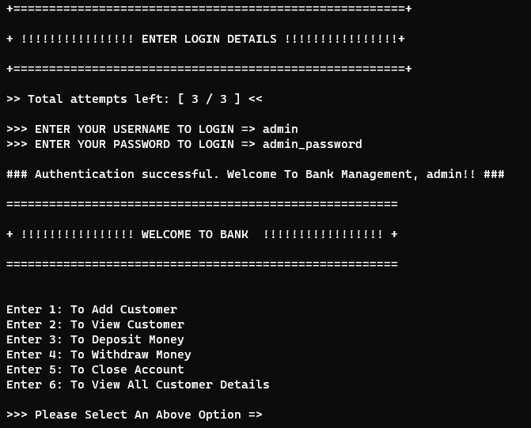
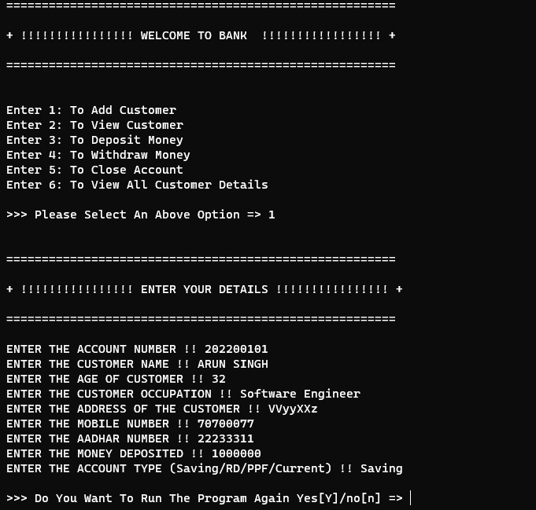
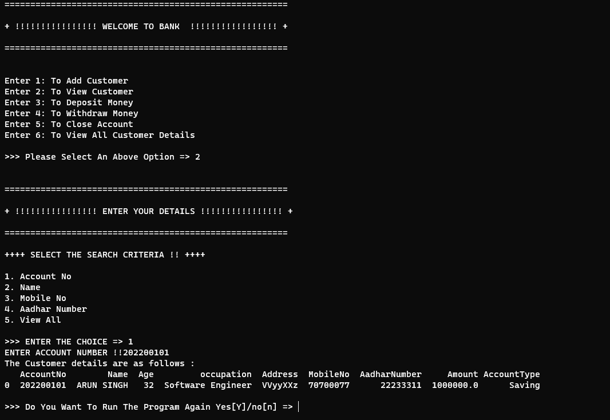
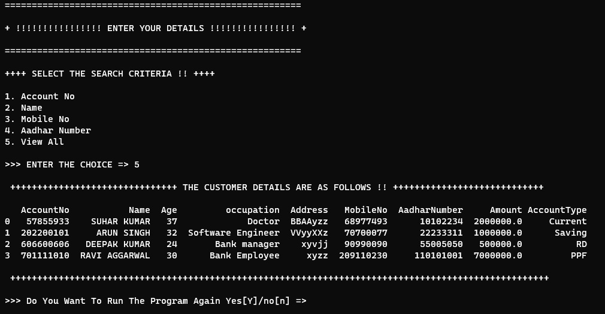
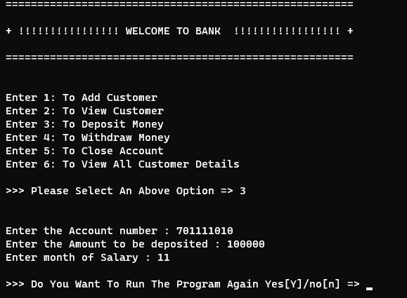
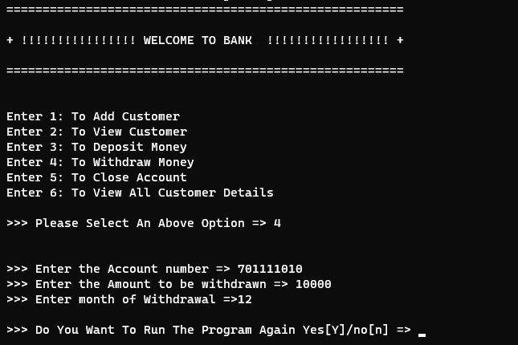
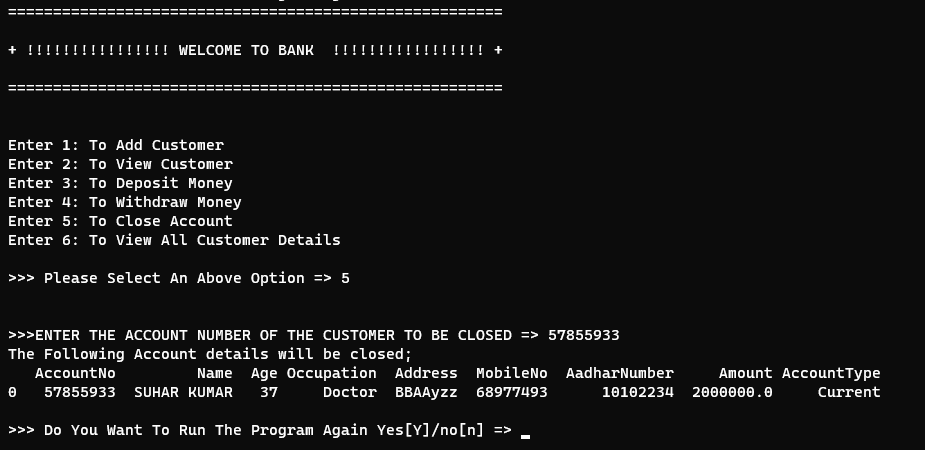
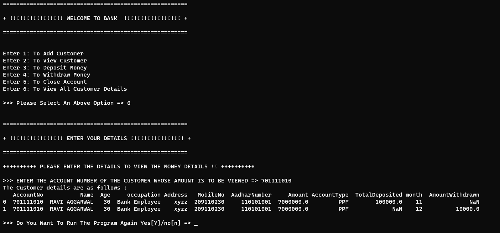

# Banking Management System

Banking System Project using Python and SQL

# Description:
This project is a comprehensive banking system implemented in Python with MySQL for database management. It provides essential functionalities required for managing banking operations efficiently, including money withdrawal and deposit, viewing customer details, adding customer details, closing accounts, viewing all customer details, and implementing username and password authentication for user access.

# Key Features:

Money Withdrawal and Deposit: Users can withdraw or deposit money from/to their accounts securely. Proper transaction logging is implemented to ensure data integrity.

View Customer Details: Users can view their account details, including personal information, balance, and transaction history.

Add Customer Details: Bank administrators can add new customers to the system by entering their relevant details such as name, address, contact information, etc.

Close Account: Customers or administrators can request to close an account, which deactivates it in the system and updates the account status accordingly.

View All Customer Details: Administrators have access to view all customer details registered in the system, facilitating efficient customer management and support.

Username and Password Authentication: Secure authentication mechanisms are implemented to ensure that only authorized users can access the system. Username and password validation are performed during login.

# Screenshots

<u>Username and Password Authentication</u>

**Add Customer Details - **

**View All Customer Details - **

**Money Withdrawal and Deposit**

**Close Account - **

**View All Customer Details - **

# Usage:

Clone the repository to your local machine.
Ensure Python and MySQL are installed.
Set up the MySQL database and configure the connection details in the script.
Run the script and follow the prompts to perform banking operations such as adding customers, viewing details, depositing/withdrawing money, etc.
Users can log in using their username and password, with a limited number of login attempts for security.
Note:
This project is provided for educational purposes and can be used as a foundation for building more complex banking systems or as a learning resource for Python programming and SQL database management.

# Credits:
The code for this project was authored by [QuantumJV] and is available on [[Banking Management System](https://github.com/QuantumJV/Bank-Management-System/tree/main)]. Special thanks to the author for sharing this valuable resource with the community.

# License:
[Specify the license under which the project is shared, e.g., MIT License, GNU General Public License, etc.]

# Contributions:
Contributions to the project are welcome. Feel free to fork the repository, make changes, and submit pull requests for consideration.

# Disclaimer:
This project should be used responsibly and ethically. Any unauthorized use or modification of the code is discouraged. The authors and contributors are not liable for any misuse or damage caused by the project.
